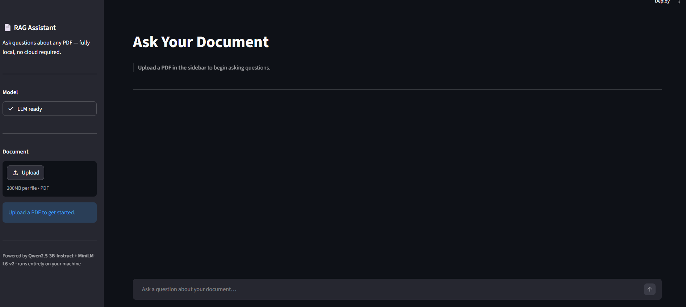
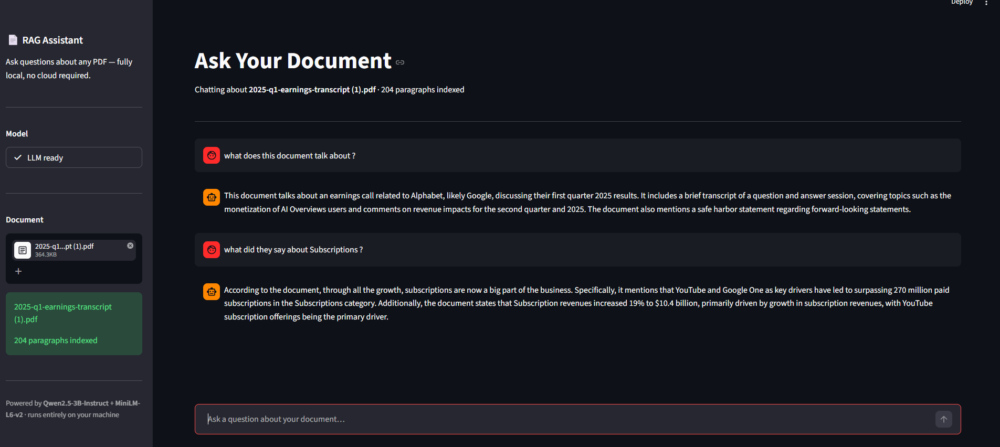

# RAG AI System — Ask Your Documents, Privately

> A Retrieval-Augmented Generation (RAG) pipeline with a Streamlit chat UI — upload any PDF, ask questions in plain English, and get grounded, streamed answers. 
>
> **Deployment**: Uses Groq API for lightning fast Llama 3 generation, built perfectly for Streamlit Community Cloud.

🚀 **Live Demo:** [rag1818.streamlit.app](https://rag1818.streamlit.app/)

[](https://www.python.org/)
[](https://streamlit.io/)
[](https://groq.com/)
[](https://huggingface.co/)

---

## What Is This?

RAG AI System is a Retrieval-Augmented Generation pipeline that lets you upload a PDF and ask natural-language questions against it — with the answer streamed token-by-token directly to your browser.

This project runs a MiniLM embedding model to convert your document into semantic vectors and retrieves the most relevant paragraphs using a pure-Python cosine-search index. The answers are then generated using Groq's lightning-fast Llama 3 API.

| File | Responsibility |
|---|---|
| `main.py` | Streamlit UI — chat interface, file upload, streaming output |
| `local_llm.py` | `AiModel` — connects to Groq API, orchestrates chat context |
| `local_embedding.py` | `LocalEmbedding` — sentence-transformers wrapper and vector index interface |
| `vector_index.py` | `VectorIndex` — pure-stdlib in-memory cosine/Euclidean vector store |
| `pdf_reader.py` | `PdfReader` — PDF text extraction and Langchain paragraph splitting |

---

## Screenshots

### Upload screen — ready state



The sidebar shows **LLM ready** once initialized. The PDF uploader accepts drag-and-drop or file browser. The chat area waits for a document before accepting questions.

---

### Active conversation



After indexing, answers stream token-by-token into the chat via Groq API. The sidebar displays the paragraph count for the indexed document. Follow-up questions reuse the cached index without re-embedding.

---

## Feature List

### Retrieval-Augmented Generation
- PDF ingestion directly from memory (no disk IO) using `pypdf`
- Advanced text chunking using Langchain's `RecursiveCharacterTextSplitter`
- Batch embedding of all chunks in a single pass using `sentence-transformers`
- Cosine similarity search over 384-dimensional MiniLM vectors
- Dynamic search query contextualization using recent chat history
- Strict grounding prompt — the model is instructed to answer only from the provided document text

### Streaming Output
- Answers stream via Groq's native client
- Tokens are yielded through the streamer without blocking the Streamlit main thread
- `st.write_stream()` renders tokens progressively as they arrive in the browser

### Caching and Session Management
- `@st.cache_resource` loads the LLM setup once per server process
- `st.session_state` persists the embedding index across follow-up questions
- **Conversational Memory**: Remembers your last 5 questions for fluid follow-ups
- Uploading a new PDF automatically resets the conversation and builds a fresh index

### Pure-Python Vector Store
- `VectorIndex` uses no NumPy, FAISS, or external vector database
- Vectors are L2-normalised at index time; similarity search reduces to a dot-product scan over stored vectors
- Both Euclidean and cosine metrics are available in the same class

---

## How It Works

1. **PDF → Chunks** — `PdfReader` reads directly from a memory stream and uses Langchain's `RecursiveCharacterTextSplitter` to generate clean, overlapping chunks of text.

2. **Chunks → Vectors** — `LocalEmbedding.build_index()` batch-embeds all chunks using `sentence-transformers` (all-MiniLM-L6-v2) and stores the 384-dimensional vectors in `VectorIndex`.

3. **Question → Context** — At query time, your latest question is dynamically appended to your previous question to maintain context. It is embedded and compared against every stored vector by cosine distance to fetch the top-k chunks.

4. **Context + History → Answer** — `AiModel` wraps the retrieved context, your chat history, and your question into a structured Chat ML array. It sends this to Groq and yields tokens into `st.write_stream()` for a live UI.

---

## Architecture

The retrieval pipeline is fully local, while LLM generation is handled by Groq for maximum speed.

```
┌──────────────────────────────────────────────────────────┐
│                    Streamlit UI (main.py)                 │
│                                                           │
│  Sidebar: [Load Model]  [Upload PDF]  [Status]           │
│  Main:    [Chat input]  →  [Streamed answer]             │
└─────────────────────────┬────────────────────────────────┘
                          │
            ┌─────────────▼──────────────┐
            │        PDF Ingestion        │
            │  PdfReader: page text →     │
            │  Langchain chunks           │
            └─────────────┬──────────────┘
                          │
            ┌─────────────▼──────────────┐
            │       LocalEmbedding        │
            │  sentence-transformers     │
            │  batch embed → 384-dim     │
            │  L2-normalised vectors      │
            └─────────────┬──────────────┘
                          │
            ┌─────────────▼──────────────┐
            │        VectorIndex          │
            │  in-memory cosine store     │
            │  (pure Python stdlib)       │
            └─────────────┬──────────────┘
                          │ top-k chunks
            ┌─────────────▼──────────────┐
            │          AiModel            │
            │  Groq Llama 3               │
            │  RAG prompt assembly        │
            │  Streaming API response     │
            └─────────────┬──────────────┘
                          │ token stream
            ┌─────────────▼──────────────┐
            │  st.write_stream()          │
            │  → live tokens in browser   │
            └─────────────────────────────┘
```

---

## Project Structure

```
RAG/
├── main.py                  # Streamlit UI — entry point
├── local_llm.py             # AiModel: connects to Groq API
├── local_embedding.py       # LocalEmbedding: Sentence-Transformers wrapper + index interface
├── vector_index.py          # VectorIndex: pure-stdlib cosine/Euclidean vector store
├── pdf_reader.py            # PdfReader: PDF → clean chunk list
├── application_screenshots/ # UI screenshots used in this README
└── requirements.txt         # Minimal dependency list
```

---

## Installation & Deployment

### Prerequisites

| Requirement | Notes |
|---|---|
| Python 3.11+ | Compatible with Streamlit Cloud runtime |
| Groq API Key | Free — Get it at [console.groq.com](https://console.groq.com/) |

### Local Development Setup

```bash
# Clone the repository
git clone https://github.com/Vittalgb-05/RAG.git
cd RAG

# Create and activate a virtual environment
python -m venv .venv
source .venv/Scripts/activate   # Windows (Git Bash)
# source .venv/bin/activate     # macOS / Linux

# Install dependencies
pip install -r requirements.txt
```

> **Windows Users**: The Hugging Face Hub (used by `sentence-transformers`) downloads model weights using symlinks. You may need to enable **Developer Mode** in your Windows Settings (Settings > Update & Security > For developers > Developer Mode) or run your terminal as an Administrator to prevent symlink warnings.

Create a `.env` file in the project root and add your key:

```
GROQ_API_KEY=gsk_your_groq_key_here
```

Run the application locally:
```bash
streamlit run main.py
```


## Usage

```bash
streamlit run main.py
```

Streamlit will print a local URL (default `http://localhost:8501`). Open it in your browser.

> **First run:** The `all-MiniLM-L6-v2` embedding model is downloaded from HuggingFace Hub and cached in `~/.cache/huggingface/`. This takes just a few seconds. Subsequent runs start instantly.

### Basic workflow

1. Wait for **"LLM ready — Groq Cloud"** in the sidebar.
2. Drag and drop one or more PDFs onto the uploader, or click **Browse**.
3. Wait for the success message showing how many paragraphs were indexed.
4. Type your question in the chat input at the bottom and press Enter.
5. The answer streams token-by-token directly from Groq. Ask follow-up questions freely — the index is cached.
6. Upload additional PDFs to add them to the index, or click **Clear All** to start a fresh conversation.

---

## Tech Stack

| Layer | Technology | Role |
|---|---|---|
| **UI** | Streamlit | Chat interface, file upload, live streaming |
| **LLM Inference** | Groq Llama 3 API | Answer generation via cloud API |
| **Embeddings** | sentence-transformers | 384-dim semantic search vectors (`all-MiniLM-L6-v2`) |
| **PDF parsing** | pypdf | Text extraction from memory buffer |
| **Chunking** | Langchain | `RecursiveCharacterTextSplitter` |
| **Vector store** | Custom `VectorIndex` | Pure-Python in-memory cosine search — no external DB |
| **Config** | python-dotenv & `st.secrets` | API key loading for local and cloud deployment |

---

## Limitations

- **In-memory index only** — `VectorIndex` is not persisted to disk; re-uploading the same PDF re-embeds it from scratch on every run.
- **Linear scan** — similarity search scans every stored vector; performance degrades on very large documents with thousands of paragraphs.
- **Context window cap** — the top-k chunks must fit within the LLM's context window; very long documents or a high `k` value can exceed it.

---

## Future Improvements

- **Persistent index** — serialize `VectorIndex.vectors` and `.documents` to disk so documents do not need to be re-embedded on every startup.
- **ANN indexing** — replace linear scan with an approximate nearest-neighbour structure (e.g. HNSW) for sub-linear search at scale.
- **Embedding progress bar** — show per-paragraph indexing progress during PDF ingestion rather than a single blocking wait.
